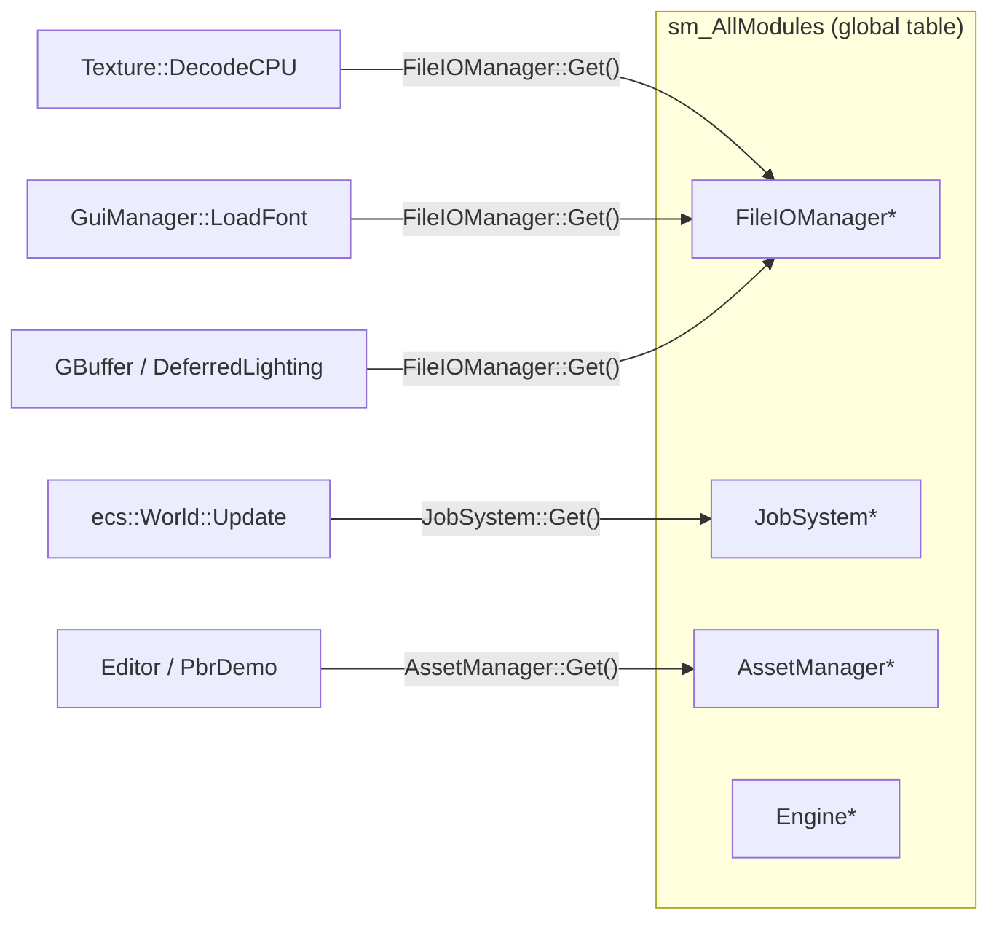
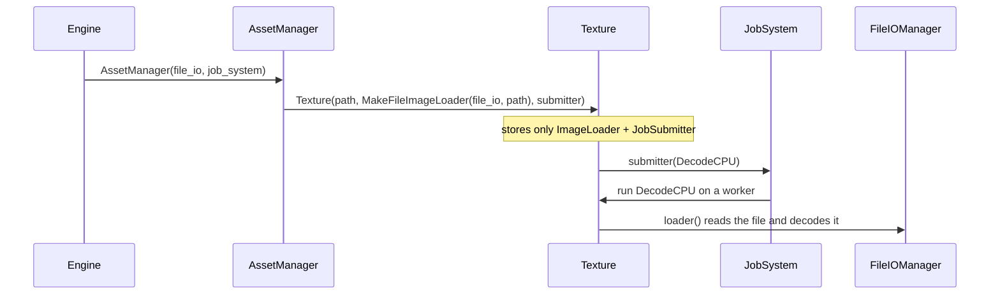
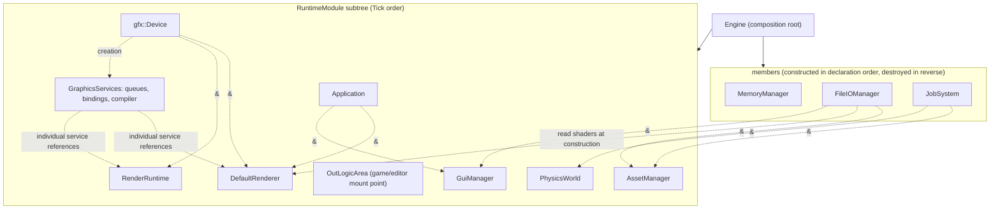
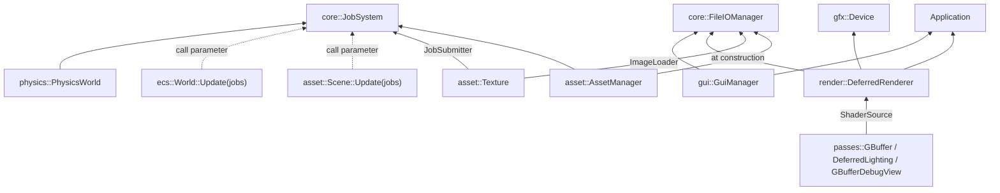

# Dependency injection (service locator to DI)

A good engine module assembly design avoids a large class of silent failures and test coupling that come from implicit global dependencies.
This DI change in Hitagi Engine is built around a few points:

* Dependencies show up in the **signature**, instead of being looked up by name in a global table at runtime
* A dependency is attached **where it is actually used**: a long-lived one goes in the constructor, one used by a single call goes in a parameter, and a request for a piece of data passes the data
* `Engine` is the only composition root, and it owns creation order and lifetime
* Tests and tools assemble themselves, and no longer depend on process-wide fake singletons

The stable summary:

```text
Before: modules found each other through RuntimeModule::GetModule / X::Get()
Now:    whoever uses a dependency declares it; Engine assembles them and exposes accessors
```

## The problem: implicit lookup

Before the change, subsystems discovered each other through a static registry:

```text
RuntimeModule constructor
  └─ sm_AllModules[name] = this

any call site
  └─ X::Get() = static_cast<X*>(GetModule("X"))
```



The cost of that pattern:

* A dependency shows up only at the call site, and is invisible in the signature
* When `Get()` returns `nullptr`, the failure is silent, or it crashes later
* Tests had to install a full set of global modules in `main`, or any case could hit a null
* Two modules cannot share a name (the registry is unique by name)

## The solution: four injection shapes

Replacing `X::Get()` with a constructor parameter only solves half of it. If the kind of dependency is ignored, service references spread through every constructor: parsing a scene file would require a thread pool first, and a render pass would hold a file system just to read one `.hlsl`.
So the shape follows **how the dependency is used**:

| Shape | When to use it | Examples |
| --- | --- | --- |
| Constructor injection (reference) | The object needs the service for its whole lifetime | `AssetManager(FileIOManager&, JobSystem&)`, `PhysicsWorld(JobSystem&)`, `GuiManager(App&, FileIOManager&)` |
| Call injection (parameter) | Only one operation needs it, and the caller already has it | `World::Update(JobSystem&)`, `Scene::Update(JobSystem&)` |
| Capability injection (function object) | Only a small slice of the service is needed, or the call crosses threads | `ImageLoader` (obtain pixels), `JobSubmitter` (submit a task) |
| Value injection (data) | What is actually needed is data the service produced | `render::ShaderSource` (source text + path) |

Rule of thumb: **first ask whether it wants the service, or the thing the service produces**. If it wants the thing, pass the thing.

### Call injection: the executor is not object state

`ecs::World` needs an executor only while it is running systems, so it no longer holds a `JobSystem`:

```cpp
class World {
    explicit World(std::string_view name);
    void Update();                         // serial, on the calling thread, in dependency topological order
    void Update(core::JobSystem& jobs);    // the same graph; systems with no dependency run in parallel
};
```

Both overloads run the same schedule graph. The serial version uses the topological order from `CheckValid`. The parallel version hands the graph to taskflow.
Structural updates such as "build a scene" or "refresh transforms once after an edit" (cooked parsing, USD import, editor command do/undo) call `Update()` and need no thread pool. Only the per-frame tick calls `Update(engine.Jobs())`.

### Capability injection: a texture only knows how to obtain pixels

```cpp
using ImageLoader = std::function<ImageData()>;

Texture(std::filesystem::path path,          // identity: dedup key, and the reference written at cook time
        ImageLoader           loader,        // how to obtain pixels (may be called on a worker thread)
        std::string_view      name = "",
        core::JobSubmitter    decode_submitter = {});  // empty = synchronous decode
```

`AssetManager` turns the service into a capability:

```cpp
std::make_shared<Texture>(key, MakeFileImageLoader(m_FileIO, key), name, m_JobSystem.MakeSubmitter());
```

`Texture` has no `FileIOManager*`, so the illegal state "has a path but no file system" cannot exist. Codecs also no longer have `Decode(file_io, path)` / `Encode(texture, file_io, path)` overloads that quietly do I/O. The caller does the I/O, and the codec only handles a `Buffer`.

### Value injection: a pass only receives shader source

```cpp
struct ShaderSource {
    std::filesystem::path path;   // diagnostics and #include resolution for the compiler
    std::pmr::string      code;
};

passes::GBuffer(gfx::Device& device, gfx::BindlessUtils& bindings,
                const gfx::ShaderCompiler& compiler, ShaderSource shader);
```

`DeferredRenderer` reads the three sources with `render::LoadShaderSource(file_io, path)` at construction and hands them to the passes. It does not keep a `FileIOManager` after that. Editor viewport passes do the same. A pass never touches the file system, and a test can pass `{.path = "unused.hlsl"}` directly.



## Composition root



Solid edges are **ownership**. Dashed edges are **injected references** (used, not owned).

Infrastructure services (`MemoryManager`, `FileIOManager`, `JobSystem`) never tick, so they are not in the module subtree. They are members of `Engine`. Their lifetime is stated by **member declaration order**, not by the implicit convention of `add_inner_module` call order. `~Engine()` calls `UnloadAllSubModules()` first and tears down the subtree. Only after every module in that subtree that holds a `FileIOManager&` or `JobSystem&` has been destroyed are the members destroyed in reverse order:

```text
Engine construction
  members: MemoryManager → FileIOManager → JobSystem
  subtree: App → Device → GraphicsServices → Assets → Physics → OutLogicArea → Debug → Renderer → Gui → RenderRuntime

~Engine
  UnloadAllSubModules(): RenderRuntime → ... → App   (subtree in reverse)
  member destruction: JobSystem → FileIOManager → MemoryManager
```

`Engine` no longer provides `Engine::Get()`. The layers above (editor, game, demo) take services from the `Engine&` they already hold:

```cpp
engine.FileIO()   engine.Jobs()     engine.App()      engine.Device()
engine.Assets()   engine.Renderer() engine.RenderRuntime()
engine.GuiManager()                 engine.Physics()
engine.Queues()   engine.Bindings() engine.ShaderCompiler()
engine.ResourceLoadContext()
```

Game logic modules are still mounted on `OutLogicArea` through `Engine::AddSubModule`. That is **subtree mounting**, not service location. `Editor` holding an `Engine&` is the application layer taking services. It depends on the whole engine, and that tradeoff is intentional. Modules inside the engine take only the few dependencies they need.

`GraphicsServices` owns the queues, bindings, and shader compiler; it is not passed to low-level resources. Resources use static `Create` methods at the assembly boundary and receive the native device, allocator, or binding facilities they actually need. They do not retain an abstract `Device`. Graphics consumers must die before bindings/queues, and those facilities must die before Device. See the [gfx contracts](../../hitagi/gfx/AGENT.md).

## Dependency graph (injection edges)

This draws only "who asks for whom in a signature", not the `RuntimeModule` parent/child tree:



Compared with before: `Scene`, `ecs::World`, `UsdSceneImporter`, `ParseCookedScene`, and `CreateEditor*Scene` no longer need a `JobSystem&`. No render or editor pass holds a `FileIOManager&`.

## How tests plug in

`unit_test_main` keeps only the process-wide `MemoryManager` (it installs the default PMR resource).
Every other service is held explicitly by a fixture, and only when that test actually needs it:

```cpp
class AssetManagerTest : public ::testing::Test {
protected:
    // declaration order = reverse destruction: the manager must die before the services it references
    core::FileIOManager file_io;
    core::JobSystem     job_system;
    asset::AssetManager assets{file_io, job_system, "assets"};
};
```

* ECS and transform tests construct `World(name)`. Tests that check the parallel path call `world.Update(job_system)`. Schedule-order tests also run the serial `Update()` once each.
* Editor scene tests call `CreateEditorFixtureScene()` directly and do not start a thread pool.
* Pass tests feed a `ShaderSource` directly.

A tool entry point with no `Engine` (for example the pbr_demo cook command) builds its own small composition root the same way. Declaration order of the local variables is the dependency order:

```cpp
hitagi::core::MemoryManager memory_manager;
hitagi::core::FileIOManager file_io;
hitagi::core::JobSystem     job_system;
hitagi::asset::AssetManager asset_manager(file_io, job_system, "assets");
```

## What was removed

| Removed | Where | Replacement |
| --- | --- | --- |
| `sm_AllModules` | `RuntimeModule` | Nothing; the module name is only a log label |
| `RuntimeModule::GetModule` | `core` | Constructor or call injection, and `Engine` accessors |
| `FileIOManager::Get` | `core` | `FileIOManager&` / `ImageLoader` / `ShaderSource` |
| `JobSystem::Get` | `core` | `JobSystem&` / `JobSubmitter` / `Update(jobs)` |
| `Engine::Get` | `engine` | The caller holds `Engine&` |
| `PhysicsWorld::Get` | `physics` | Constructor injection |
| `OutLogicArea::Get` | `engine` | `Engine` holds the pointer directly |
| `ImageCodec::Decode(path)` / `Encode(texture, path)` | `asset` | The caller reads and writes a `Buffer` |
| Global FileIO/JobSystem in `unit_test_main` | tests | Local fixture instances |

What stays, and is **not** a service locator:

* `RuntimeModule::AddSubModule` / `UnloadSubModule`: parent/child tree ownership
* `RuntimeModule::GetSubModule` / `GetSubModules`: queries inside the subtree (no callers today)
* `m_Registry` inside `AssetManager`: resource-identity dedup (a weak-reference table), unrelated to module discovery

## Lifetime rules

What gets injected is a reference, or a function object that captured a reference. Injection **does not extend lifetime**. The composition root guarantees the rule:

* `Engine`: infrastructure services are members, and `~Engine()` tears down the subtree before destroying members (see above)
* Test fixtures and cook tools: declaration order is dependency order, and the language guarantees reverse destruction
* `MakeFileImageLoader` captures `FileIOManager&`: a texture must not outlive `FileIOManager`. In the engine, textures are destroyed with `AssetManager` and the scene, inside the subtree, which satisfies the rule
* An async decode task captures `shared_ptr<Texture>`, not `AssetManager`. `JobSystem`'s destructor waits for tasks to finish
* `Schedule` temporarily records the current `JobSystem*` while a parallel run is in progress (only to name worker threads), and clears it when the run ends

## Build note

After the layout of an exported class such as `Engine` or `World` changes, every translation unit that imports it must be rebuilt. An inline member function in a module interface (for example `Engine::Assets()`) is emitted as a COMDAT in every object file that uses it, and the linker keeps one copy. If an incremental build skips an object file, an accessor compiled against the old layout can be the one that survives, and the symptom is an access violation after the wrong object is returned. When that happens, run `xmake build -r` first.

## Summary

```text
Problem: looking up modules by name in a global table meant implicit, nullable, and hard to test
Approach: whoever uses a dependency declares it; the shape follows the use — constructor reference, call parameter, capability function, or data value
Assembly: Engine is the composition root and infrastructure services are members; tests and tools each assemble a small root of their own
Result:  the code no longer has sm_AllModules, X::Get(), or Engine::Get(),
         and it no longer holds a service reference only to pass it along
```

Related entry points:

* Assembly: `hitagi/engine/engine.cpp`
* Accessor declarations: `hitagi/engine/engine.cppm`
* Capability injection on the resource side: `hitagi/asset/asset_manager.cpp`, `hitagi/asset/texture.cpp`
* ECS call injection: `hitagi/ecs/world.cpp`, `hitagi/ecs/schedule.cpp`
* Shader value injection: `hitagi/render/render.cppm` (`ShaderSource` / `LoadShaderSource`)
* Module base class: `hitagi/core/core.cppm`, `hitagi/core/runtime_module.cpp`
* Resource lifecycle (including loader and submitter semantics): [../assets/resource_lifecycle.md](../assets/resource_lifecycle.md)
