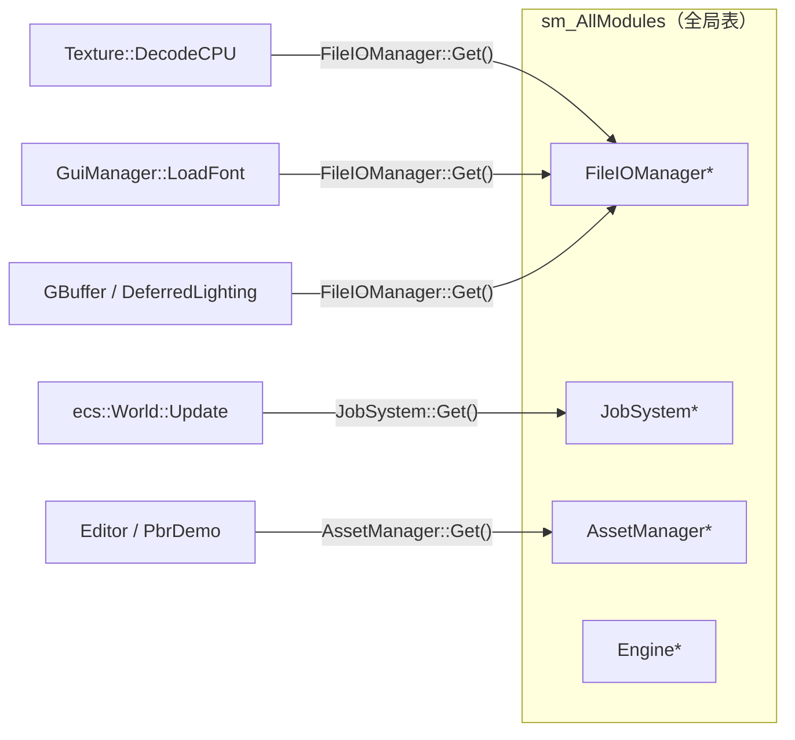
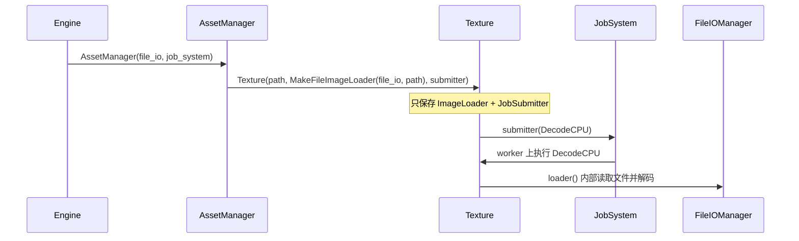
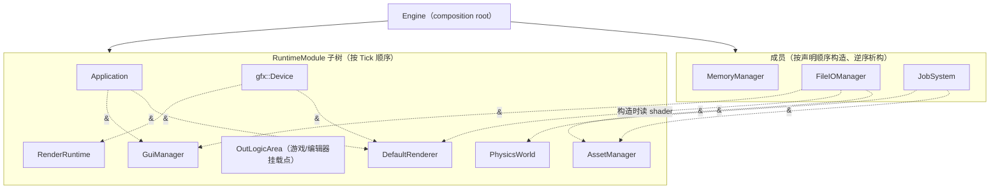
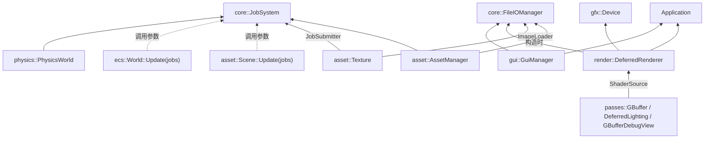

# 依赖注入（Service Locator → DI）

一个好的引擎模块装配设计，可以很大程度上避免“隐式全局依赖”带来的静默失败与测试耦合。
在 Hitagi Engine 中，这次 DI 改造着重考虑几个点：

* 依赖在**签名**上显式出现，而不是运行时按名字去全局表里捞
* 依赖挂在**真正使用它的地方**：长期使用的进构造函数，只在某次调用里用的进参数，只要一份数据的就传数据
* `Engine` 作为唯一的 composition root，负责创建顺序与寿命
* 测试、工具自己装配，不再依赖进程级假单例

稳定说法：

```text
以前：模块通过 RuntimeModule::GetModule / X::Get() 互相找
现在：谁用谁声明；Engine 装配并提供访问器
```

## 问题：隐式查找

改造前，子系统通过静态注册表互相发现：

```text
RuntimeModule 构造
  └─ sm_AllModules[name] = this

任意调用点
  └─ X::Get() = static_cast<X*>(GetModule("X"))
```



这种模式的代价是：

* 依赖在调用点才暴露，签名上看不出来
* `Get()` 返回 `nullptr` 时容易静默失败或事后崩溃
* 测试必须在 `main` 里先装一整套全局模块，否则任意用例都可能踩空
* 同名模块不能并存（注册表按名字唯一）

## 解法：四种注入形态

“把 `X::Get()` 换成构造参数”只解决了一半。如果不区分依赖的性质，服务引用会顺着构造函数一路扩散：
解析一个场景文件要先有线程池，render pass 为了读一个 `.hlsl` 要持有文件系统。
所以按依赖的**用法**选形态：

| 形态 | 什么时候用 | 例子 |
| --- | --- | --- |
| 构造注入（引用） | 对象整个生命周期都要用这个服务 | `AssetManager(FileIOManager&, JobSystem&)`、`PhysicsWorld(JobSystem&)`、`GuiManager(App&, FileIOManager&)` |
| 调用注入（参数） | 只有某个操作需要，且调用方天然持有 | `World::Update(JobSystem&)`、`Scene::Update(JobSystem&)` |
| 能力注入（函数对象） | 只需要服务的一小部分能力，或要跨线程 | `ImageLoader`（拿像素）、`JobSubmitter`（提交任务） |
| 值注入（数据） | 真正要的是服务产出的数据 | `render::ShaderSource`（源码 + 路径） |

判断口诀：**先问“它要的是服务，还是服务给的东西”**。要的是东西，就传东西。

### 调用注入：执行器不是对象的状态

`ecs::World` 只有在跑 system 时才需要执行器，所以它不再持有 `JobSystem`：

```cpp
class World {
    explicit World(std::string_view name);
    void Update();                         // 调用线程上按依赖拓扑序串行执行
    void Update(core::JobSystem& jobs);    // 同一张图，无依赖的 system 并行执行
};
```

两个重载执行同一个调度图：串行版本走 `CheckValid` 得到的拓扑序，并行版本交给 taskflow。
于是“构建场景 / 编辑场景后刷新一次 transform”这类结构性更新（cooked 解析、USD 导入、
编辑器命令的 do/undo）用 `Update()`，完全不需要线程池；只有每帧 Tick 调 `Update(engine.Jobs())`。

### 能力注入：纹理只知道“怎么拿像素”

```cpp
using ImageLoader = std::function<ImageData()>;

Texture(std::filesystem::path path,          // 身份：去重键、cook 时写出的引用
        ImageLoader           loader,        // 怎么拿到像素（可能在 worker 线程调用）
        std::string_view      name = "",
        core::JobSubmitter    decode_submitter = {});  // 空 = 同步解码
```

`AssetManager` 负责把服务变成能力：

```cpp
std::make_shared<Texture>(key, MakeFileImageLoader(m_FileIO, key), name, m_JobSystem.MakeSubmitter());
```

`Texture` 里没有 `FileIOManager*`，也就不存在“有路径却没有文件系统”这种非法状态；
codec 也不再有 `Decode(file_io, path)` / `Encode(texture, file_io, path)` 这种顺手做 IO 的重载，
IO 由调用方做，codec 只处理 `Buffer`。

### 值注入：pass 只拿 shader 源码

```cpp
struct ShaderSource {
    std::filesystem::path path;   // 给编译器做诊断与 #include 解析
    std::pmr::string      code;
};

passes::GBuffer(gfx::Device& device, ShaderSource shader);
```

`DeferredRenderer` 在构造时用 `render::LoadShaderSource(file_io, path)` 读三份源码交给 pass，
之后不再保留 `FileIOManager`；编辑器 viewport 的 pass 同理。pass 不接触文件系统，
测试可以直接喂 `{.path = "unused.hlsl"}`。



## Composition Root



实线是**所有权**，虚线是**注入的引用**（不拥有、只使用）。

基础设施服务（`MemoryManager` / `FileIOManager` / `JobSystem`）从不 Tick，所以不放进模块子树，
而是 `Engine` 的成员。这样它们的寿命由**成员声明顺序**说明，而不是靠 `add_inner_module`
调用顺序这种隐式约定。`~Engine()` 先调用 `UnloadAllSubModules()` 拆掉子树，子树里所有
持有 `FileIOManager&` / `JobSystem&` 的模块都析构完之后，成员才按逆序销毁：

```text
Engine 构造
  成员：MemoryManager → FileIOManager → JobSystem
  子树：App → Device → Assets → Physics → OutLogicArea → Debug → Renderer → Gui → RenderRuntime

~Engine
  UnloadAllSubModules()：RenderRuntime → ... → App   （子树逆序）
  成员析构：JobSystem → FileIOManager → MemoryManager
```

`Engine` 不再提供 `Engine::Get()`。上层（editor / game / demo）从自己持有的 `Engine&` 取服务：

```cpp
engine.FileIO()   engine.Jobs()     engine.App()      engine.Device()
engine.Assets()   engine.Renderer() engine.RenderRuntime()
engine.GuiManager()                 engine.Physics()
```

游戏逻辑模块仍通过 `Engine::AddSubModule` 挂到 `OutLogicArea`；那是**子树挂载**，不是服务定位。
`Editor` 持有 `Engine&` 属于应用层取服务，它依赖的是整台引擎，这是有意的取舍；
引擎内部的模块则只拿自己需要的那几个依赖。

## 依赖图（按注入边）

只画“谁在签名里要谁”，不画 `RuntimeModule` 父子树：



对比改造前：`Scene`、`ecs::World`、`UsdSceneImporter`、`ParseCookedScene`、`CreateEditor*Scene`
都不再需要 `JobSystem&`；所有 render / editor pass 都不再持有 `FileIOManager&`。

## 测试侧怎么接

`unit_test_main` 只保留进程级的 `MemoryManager`（它安装 PMR 默认资源）。
其余服务由 fixture 显式持有，而且只在真正需要时才持有：

```cpp
class AssetManagerTest : public ::testing::Test {
protected:
    // 声明顺序 = 析构逆序：manager 必须先于它引用的服务销毁
    core::FileIOManager file_io;
    core::JobSystem     job_system;
    asset::AssetManager assets{file_io, job_system, "assets"};
};
```

* ECS / transform 测试构造 `World(name)` 即可；需要验证并行路径的用 `world.Update(job_system)`，
  调度顺序测试对串行 `Update()` 也各跑一遍
* 编辑器场景测试直接 `CreateEditorFixtureScene()`，不用再起线程池
* pass 测试直接喂 `ShaderSource`

无 `Engine` 的工具入口（例如 pbr_demo 的 cook 命令）同样自己搭一个迷你 composition root，
用局部变量的声明顺序表达依赖顺序：

```cpp
hitagi::core::MemoryManager memory_manager;
hitagi::core::FileIOManager file_io;
hitagi::core::JobSystem     job_system;
hitagi::asset::AssetManager asset_manager(file_io, job_system, "assets");
```

## 删掉了什么

| 删除项 | 位置 | 替代 |
| --- | --- | --- |
| `sm_AllModules` | `RuntimeModule` | 无；模块名只作日志标签 |
| `RuntimeModule::GetModule` | `core` | 构造 / 调用注入，`Engine` 访问器 |
| `FileIOManager::Get` | `core` | `FileIOManager&` / `ImageLoader` / `ShaderSource` |
| `JobSystem::Get` | `core` | `JobSystem&` / `JobSubmitter` / `Update(jobs)` |
| `Engine::Get` | `engine` | 调用方持有 `Engine&` |
| `PhysicsWorld::Get` | `physics` | 构造注入 |
| `OutLogicArea::Get` | `engine` | `Engine` 直接持有指针 |
| `ImageCodec::Decode(path)` / `Encode(texture, path)` | `asset` | 调用方读写 `Buffer` |
| `unit_test_main` 里的全局 FileIO/JobSystem | tests | fixture 本地实例 |

保留但**不是**服务定位器的东西：

* `RuntimeModule::AddSubModule` / `UnloadSubModule`：父子树所有权
* `RuntimeModule::GetSubModule` / `GetSubModules`：子树内查询（当前无调用方）
* `AssetManager` 内部的 `m_Registry`：资源身份去重（弱引用表），与模块发现无关

## 寿命约定

注入的是引用或捕获了引用的函数对象，**不延长寿命**。约定由 composition root 保证：

* `Engine`：基础设施是成员，`~Engine()` 先拆子树再析构成员（见上文）
* 测试 fixture 与 cook 工具：声明顺序 = 依赖顺序，语言保证逆序析构
* `MakeFileImageLoader` 捕获 `FileIOManager&`：纹理不能活得比 `FileIOManager` 久；
  在引擎里纹理随 `AssetManager` / 场景一起在子树里析构，满足要求
* 异步解码任务捕获的是 `shared_ptr<Texture>`，不是 `AssetManager`；`JobSystem` 析构时会等任务结束
* `Schedule` 在并行执行期间临时记下当前的 `JobSystem*`（只用于给 worker 线程命名），执行完即清空

## 构建注意事项

`Engine`、`World` 这类导出类的布局变化后，要确保所有 import 它们的翻译单元都重新编译。
模块接口里的内联成员函数（如 `Engine::Assets()`）会在每个使用它的 obj 里生成 COMDAT，
链接器只保留其中一份；如果增量构建漏编了某个 obj，旧布局的访问器可能被选中，
表现为拿到错误对象后的访问违例。遇到这种症状先 `xmake build -r`。

## 总结

```text
问题：按名字在全局表里找模块 → 隐式、可空、难测
做法：谁用谁声明；按用法选形态——构造引用 / 调用参数 / 能力函数 / 数据值
装配：Engine 是 composition root，基础设施是成员；测试 / 工具各自迷你装配
结果：代码里不再存在 sm_AllModules / X::Get() / Engine::Get()，
      也没有“为了转交而持有”的服务引用
```

相关入口：

* 装配实现：`hitagi/engine/engine.cpp`
* 访问器声明：`hitagi/engine/engine.cppm`
* 资源侧能力注入：`hitagi/asset/asset_manager.cpp`、`hitagi/asset/texture.cpp`
* ECS 调用注入：`hitagi/ecs/world.cpp`、`hitagi/ecs/schedule.cpp`
* shader 值注入：`hitagi/render/render.cppm`（`ShaderSource` / `LoadShaderSource`）
* 模块基类：`hitagi/core/core.cppm`、`hitagi/core/runtime_module.cpp`
* 资源生命周期（含 loader / submitter 语义）：[../assets/resource_lifecycle.md](../assets/resource_lifecycle.md)
