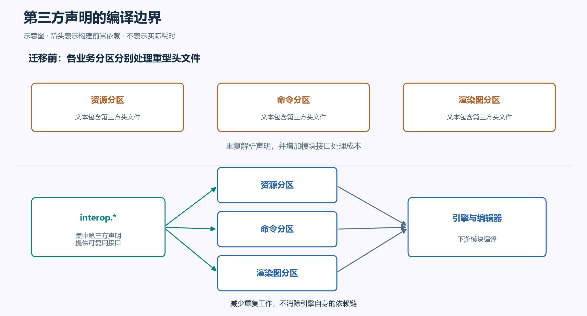

# 和 agent 一起优化 Hitagi Engine 的 C++ Modules 编译速度

重构 Hitagi Engine 的 gfx 时，我将资源创建从 Device 中分离，并用 module partition 按职责组织接口。随后，干净构建耗时从此前记录的约 97 秒增加到 123 秒。由于资源依赖和模块布局同时改变，这还不能直接归因于 partition。

这篇记录 2026 年 10 月 8 日到 9 日，我如何与 agent 一步步定位这次回退。后期一组 clang-cl 构建测到了 25.10 秒，gfx 分区仍然保留。不过，各阶段基线不同，不能将它们拼成一次严格的端到端对照；这些数据也早于后续 MSVC 兼容修复。

## 先确认构建系统实际做了什么

最初我让 agent 保存提交，再保持资源依赖设计不变，将接口分区合回主接口。分区版复测为 122.34 秒，合并版两次平均为 92.45 秒。agent 因此建议采用“单 cppm 接口 + 多个普通 cpp 实现”。

但我希望声明仍能按职责分散，而不是全部集中到主接口。于是继续追问：差距来自分区本身，还是当前构建方式？

这里需要区分文件扩展名和模块角色。`export module gfx.dx12:command_list;` 即使写在 `.cpp` 中，仍是需要生成 BMI（预编译模块接口）的接口分区；`module gfx.dx12;` 才是普通实现单元。真正影响构建的是这些单元的依赖和任务数量，而不是 `.cppm` 文件数。

agent 统计日志后发现：35 个分区加 6 个主接口，本应对应 41 个 gfx BMI，却产生了 164 次编译。`engine`、`hitagi_editor`、`editor`、`unit_tests` 各生成了一份。

我让它转向 XMake 源码，捕获复用检查中的实际参数差异。问题集中在三处：clang-cl 路径未正确过滤 `/Fd`、`/external:I/W` 等参数差异；公共包原始编译选项未完整继承；扫描器又将已复用的依赖源码加入普通编译队列。

修复只规范化复用比较，不删除源码编译所需的 include 路径，也不通过 `reuse.nocheck` 忽略语言、运行库及宏配置差异。普通实现文件当时被标为 public，也是工程侧的触发条件；后续已改为 private，仅接口和接口分区保持 public。

agent 最先测了合并版，我又要求补测分区版。固定分区源码、只切换 XMake 修复组合，前后各测两次：

| 指标 | 修复前 | 修复后 |
| --- | ---: | ---: |
| 平均构建耗时 | 122.71 s | 94.18 s |
| gfx BMI 编译次数 | 164 | 41 |
| 对象文件编译次数 | 266 | 147 |

重复工作确实消除了，但修复后的合并版为 59.78 秒，分区版仍慢约 34 秒，差距与修复前接近。这迫使我们修正归因：**修掉一个真实问题，不等于解释了最初的性能现象。**

## 用 trace 找到关键路径

下一轮我要求保留分区，让 agent 用编译 trace 定位成本，再独立测试候选方案。正式计时关闭 trace，避免混入诊断开销。下面是这一轮各两次的均值：

| 方案 | 干净构建耗时 | 相对本轮基线减少 |
| --- | ---: | ---: |
| 原始分区 | 92.41 s | — |
| 仅 reduced BMI | 91.72 s | 0.74% |
| 仅 Vulkan 官方 module | 91.58 s | 0.90% |
| 清理 render graph 无用头文件 | 77.43 s | 16.21% |
| 头文件清理 + Vulkan module | 68.11 s | 26.30% |

最明确的单项收益，是删除四个 render graph 分区里五行无用的 spdlog/fmt include。命名模块并不会自动消除 global module fragment 中的文本包含成本：多个分区仍可能反复解析、序列化和处理同一批声明。[Clang 性能说明](https://clang.llvm.org/docs/StandardCPlusPlusModules.html#reduce-duplications)

trace 中，render graph 分区链由 23.60 秒降到 7.00 秒，AST 写入由 13.53 秒降到 2.88 秒。Vulkan 官方 module 也将自己的分区链从 50.72 秒缩短到 28.11 秒，但单独使用时，总构建耗时几乎没变，因为 editor 仍受 `render_graph → gui → render → engine` 这条路径限制。

这就是总工作量与关键路径的区别：局部任务变快，不一定改变最终完成时间。清理 render graph 后，Vulkan 优化才在组合实验中进一步产生整体收益。至于不足 1% 的差异，在每组两次的样本量下不足以认定稳定加速。

## 将重复依赖集中到 interop

确认头文件成本后，我提出：删除无用 include，把必要的第三方声明集中到 module 中，供业务代码导入。仅建立一个到处 include 的 `common.h` 不够，消费者需要共享编译后的接口。

Vulkan-Hpp 优先使用官方模块；没有官方入口的库则用桥接模块导出已有实体。以 fmt 的缩减示例说明：

```cpp
module;
#include <fmt/color.h>

export module interop.fmt;
export namespace fmt {
using ::fmt::format;
using ::fmt::color;
using ::fmt::fg;
}
```

消费者仍调用 `fmt::format(...)`。这种方式保留上游类型身份，但 ABI 兼容仍依赖构建配置，导入和实例化也需要验证；include 不会自动导出全部名字，桥接层必须维护导出清单。



图中箭头表示构建前置依赖。集中头文件处理可以减少重复工作，但不会消除引擎自身的依赖链。

首轮接入 Vulkan、日志和 DX12 模块，并清理无用头文件后，两次构建均值从 89.28 秒降到 50.63 秒。两侧均使用已修复的 XMake，gfx 分区数量不变。这支持了我希望保留的方案：优化分区携带的依赖，而不是先放弃分区。

随后，我要求将桥接集中到 `hitagi/interop`，按库命名为 `interop.fmt`、`interop.spdlog` 等，使用哪个库就显式导入哪个。agent 负责调用点审计、迁移和验证，我负责约束边界：模块按库组织，构建目标按 runtime、editor、test 划分，benchmark 后续独立按需启用，避免编辑器和测试依赖进入运行时。

## 宏迁移不能只以编译通过为标准

首轮仍保留了 VMA 和 Tracy 的头文件，我继续要求区分：这是语言限制，还是迁移没有覆盖完整？VMA 的类型、函数和唯一实现可以集中到 interop；Tracy 则需要保留宏的调用点语义。

例如，把 `ZoneScoped` 放进 `inline void profile_scope()`，计时对象会在函数返回时销毁，无法测量调用者后续代码；内联优化不会改变对象生命周期。禁用 profiling 时也一样：原宏可能省略参数表达式，空函数却仍会先求值实参。

最终采用 module 加薄宏头：类型和操作放进模块，作用域、源码位置、禁用时不求值等行为保留在宏中，薄宏头不再包含原来的重型依赖。这比追求消费者中的“零 include”更重要。

补齐剩余依赖后，一组单次对照从 36.65 秒降到 25.10 秒，BMI 次数却从 90 增到 109。增加可复用接口与消除重复处理可以同时发生，因此 BMI 数量本身不是性能目标。

这组记录早于 fmt/spdlog 改为静态编译库及后续 MSVC 兼容修复，并非当前配置的复测。该迁移阶段在 clang-cl 下验证了 DX12、Vulkan 和 profiling 开关；关闭 profiling 时有 232 项单元测试通过、2 项原有跳过，编辑器测试 37 项通过，不代表后续 MSVC 配置的完整测试结果。

本文测量主要采用 Windows x64、Debug、clang-cl 23.1.2、C++23，以 `-j 34` 构建 `editor unit_tests`，关闭编译缓存，清理项目产物但保留已安装的依赖包。早期 XMake 对照关闭 clangd，最后一组两侧都保持运行。各轮收益仅对应各自基线，不能累加，也不能外推到其他编译器或所有增量场景。[原始样本](data/build-measurements.json)

## agent 的价值在于缩短验证循环

这次协作没有依赖一条复杂的 prompt。真正有效的是把任务逐步收窄：先比较布局，再解释重复任务，然后用 trace 检验剩余成本。每轮都保留源码状态、命令、日志和测试结果，让下一次追问有可检查的依据。

agent 降低了工具链追踪、跨文件修改和重复实验的执行成本；我需要持续判断的，是架构约束是否被保留，以及证据是否足以支持结论。XMake 修复最终也形成了带最小复现和回归测试的 [模块复用 PR](https://github.com/xmake-io/xmake/pull/7850) 等上游提交。

结果不只是构建时间缩短：gfx 仍按职责组织，第三方依赖有了明确入口，而“分区太慢”这个笼统判断，被拆成了可以分别验证和修复的问题。
