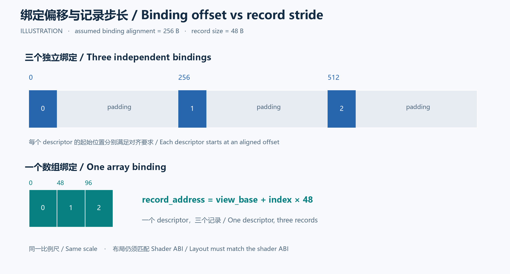
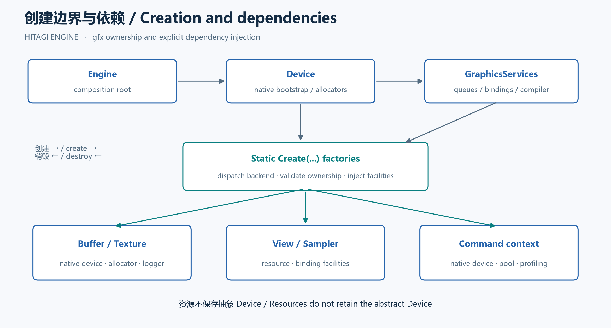

# Hitagi Engine 的 gfx 抽象重构

中文与英文完整版本 · Chinese and English editions

## 中文

给渲染引擎增加一个 `Device::CreateTexture()` 很容易。更难的是，当纹理需要分配显存、上传数据、创建描述符、参与 Render Graph，再等待 GPU 完成之后销毁时，这些工作应该分别由谁负责。

Hitagi Engine 的这轮 gfx 重构围绕这个问题展开：对象创建时显式传入所需服务，后端对象只保留实际使用的依赖。它沿用已有的 Buffer、View 和 Render Graph 访问边设计，让这些对象的职责与依赖更加一致。这些边界也决定了另一个问题的答案：移除资源上的 `Device&` 后，是否必须增加一个 `DeviceId`？

### 文件拆分暴露了实现依赖

重构最初只是想把庞大的 `.cppm` 按历史文件职责拆开，采用 asset 的“聚合主接口加 `.cpp` 接口分区”布局。很快便遇到一个闭环：Device 的工厂要 `make_shared<CommandList>()`，需要完整的 CommandList 类型；CommandList 又调用 Device 的 getter，需要完整的 Device 类型。

前向声明只够声明指针与引用，不能支持上述构造和成员访问。普通 `namespace` 也不是独立编译阶段：同一个分区中不导出的函数体，仍然参与该分区编译。把完整类声明堆进 `types.cpp`，只能改变依赖出现的位置。

这不意味着所有双向对象关系都有问题。传统的声明与实现分离同样能正确组织这些代码。本次选择进一步收窄运行期依赖，是因为资源需要的通常只是 allocator、原生设备或 bindings，没有必要获得完整的引擎 Device 和它提供的所有服务。保留领域中的归属关系，可以同时减少实现对完整类型的依赖。

### 从一个 Buffer 开始

假设我们要把一组绘制记录上传到 GPU。最直接的想法是让 Buffer 同时记录元素数量、元素大小和访问方式。这个模型在只有一种解释方式时很好用，但遇到同一块存储的局部访问、不同步长或重叠 View，就开始混淆两个问题：分配了多少字节，以及这些字节怎样被使用。

当前 `GPUBufferDesc::size` 只表示字节数。`GPUBufferViewDesc` 另外描述 `offset`、`element_size`、`element_count`、`element_stride` 和读写类型。View 持有 Buffer 的 `shared_ptr`，但创建 View 不会移动或重新排列 Buffer 中的数据。[资源与 View 定义](../../hitagi/gfx/base/gpu_resource.cpp)

| 概念 | 回答的问题 | 不承担的职责 |
| --- | --- | --- |
| `GPUBuffer` | 有多少字节，怎样分配和映射 | 决定每一条记录的布局 |
| `GPUBufferView` | 从哪里开始，以什么步长解释多少个元素 | 隐式补齐或搬运元素 |
| `TextureView` | 使用哪些子资源，以什么用途访问纹理 | 拥有另一份纹理存储 |
| 访问边 Access edge | 哪个 Pass 以什么方式访问资源 | 成为新的物理资源 |
| `BindlessHandle` | Shader 怎样定位某个绑定 | 保证 GPU 已经结束使用 |

下面是按当前接口编写的使用片段。`device` 和 `bindings` 由调用者持有，且在片段中的对象之后销毁。

```cpp
namespace gfx = hitagi::gfx;

struct DrawRecord {
    std::uint32_t material;
    std::uint32_t instance;
    std::uint32_t flags;
    std::uint32_t reserved;
};
static_assert(sizeof(DrawRecord) == 16);

std::shared_ptr<gfx::GPUBuffer> buffer = gfx::GPUBuffer::Create(
    device,
    {.name = "DrawRecords",
     .size = sizeof(DrawRecord) * 3,
     .usages = gfx::GPUBufferUsageFlags::MapWrite |
               gfx::GPUBufferUsageFlags::StorageRead});

std::shared_ptr<gfx::GPUBufferView> view = gfx::GPUBufferView::Create(
    device, bindings,
    {.name = "DrawRecordsView",
     .buffer = buffer,
     .element_size = sizeof(DrawRecord),
     .element_count = 3,
     .element_stride = sizeof(DrawRecord)});

{
    gfx::GPUBufferView::MappedSpan<DrawRecord> records =
        view->GetMappedSpan<DrawRecord>();
    records[0] = DrawRecord{7, 0, 0, 0};
    records[1] = DrawRecord{7, 1, 0, 0};
    records[2] = DrawRecord{9, 2, 0, 0};
} // RAII ends the mapping; GPU synchronization remains the caller's job.
```

`MappedSpan<T>` 从 View 创建，因此使用的是同一套范围和步长。它检查元素大小、映射权限及对齐条件，并在析构时解除映射。对于非连续的多元素映射，应使用下标或逐元素访问；不能把它当作普通连续数组调用 `data()`。

### 绑定对齐与记录步长是两回事

假设设备要求独立 Storage 绑定的起始偏移按 256 字节对齐，而一条记录占 48 字节。如果为每条记录建立独立绑定，第二个绑定可能需要从偏移 256 开始。但如果三条记录共享一个从偏移 0 开始的 View，Shader 可以在该 View 内按 48 字节步长访问它们。



图 1：256 字节是示例设备约束，48 字节是示例记录布局。应用仍须满足实际 Shader ABI；本图不为任意 C++ 类型规定布局。

Vulkan 的 `minStorageBufferOffsetAlignment` 定义的是 Storage descriptor 的起始偏移要求；它不能直接用来推导数组内元素的步长。[Vulkan Limits](https://docs.vulkan.org/spec/latest/chapters/limits.html)

Hitagi 通过 `GPUBuffer::GetStorageViewRequirements(device)` 暴露独立绑定的约束。当前 Vulkan 实现把偏移对齐取为 `max(4, minStorageBufferOffsetAlignment)`，绑定范围大小按 4 字节对齐。调用者据此安排存储，View 检查布局，不会自动把每条记录扩成一个对齐块。

对于元素数为 `N`、步长为 `S`、元素大小为 `E` 的非空 View，其有效数据覆盖长度是：

```text
payload_size = (N - 1) * S + E
```

实现先通过除法检查可容纳元素数，避免直接计算乘加时溢出，再对绑定尾部做大小对齐。`element_stride == 0` 表示紧密排列，即使用 `element_size`；它并不表示让后端任意选择布局。[View 校验实现](../../hitagi/gfx/base/gpu_resource.cpp)

这也解释了为什么绘制记录通常应共享一个 View，再通过记录索引和步长寻址。Hitagi 的 `BindlessMetaInfo` 承载 handle、index、stride，CPU 与 HLSL 必须对这些字段保持一致。

### Device 不再承担所有对象的工厂与服务入口

在提交 `1661c464` 之前的实现中，抽象 `Resource` 保存 `Device&` 并暴露 `GetDevice()`；Device 提供大量虚拟创建函数。View 在释放 bindless handle 时，还会沿着 `GetDevice().GetBindlessUtils()` 查找绑定设施。

这条路径隐藏了真正的依赖：释放描述符需要的是绑定设施，而分配显存需要的是分配器。两者都不需要通过完整的 Device 抽象获得所有图形服务。

当前接口把创建入口放到资源类型上，例如 `GPUBuffer::Create(device, desc)` 和 `GPUBufferView::Create(device, bindings, desc)`。这里的关键变化是工厂内部完成了依赖组装：选择后端、检查归属，再把具体依赖传给后端构造函数。



图 2：箭头表示创建顺序或依赖传递；下方对象不会通过一个通用服务定位器寻找它们需要的服务。

以 Buffer 为例，DX12 创建路径给 `DX12GPUBuffer` 注入 D3D12MA allocator 和 logger；Vulkan 路径给 `VulkanBuffer` 注入原生 device、自定义 allocator、VMA allocator 和 logger。基础 `Resource` 不再保留抽象 Device。后端仍然依赖原生设备和分配设施的生命周期。[创建实现](../../hitagi/gfx/base/resource_creation.cpp)

| 职责 | 当前承担者 | 设计影响 |
| --- | --- | --- |
| 原生设备启动和分配设施 | 后端 Device | 保留设备层的真实职责 |
| 队列、bindings、ShaderCompiler 的所有权 | Engine 的 `GraphicsServices` | 在 Device 之后创建，在 Device 之前销毁 |
| 后端选择与创建依赖校验 | `resource_creation.cpp` | 将组装逻辑集中到创建边界 |
| 原生资源分配与映射 | 后端 Resource | 使用具体依赖 |
| bindless handle 和附件描述符 | View 或 Sampler | 描述符生命周期跟随访问对象 |
| 图内资源依赖与执行期保留 | Render Graph | 保留资源直到对应 GPU 工作完成 |

纹理上传是一个有代表性的边界情况。分配纹理和提交初始化命令需要不同能力，因此 `Texture::Create` 显式接收 queues 和 bindings；需要命令提交的初始化流程在组装层完成，分配和映射仍留在后端。

代价也很具体：静态创建函数使调用者看到更多参数，新增后端需要扩展集中式分派。这适合目前 DX12、Vulkan、Mock 这组明确的后端；它并不是一个运行时插件式后端发现方案。

### 移除 Device 引用之后如何检查设备归属

两个对象都是 Vulkan 类型，并不代表它们来自同一个 Vulkan device。资源类型正确、设备实例正确和对象仍然存活，是三项不同的条件。

当前实现没有增加通用 `DeviceId`。创建边界利用已有信息检查归属：DX12 查询原生资源或队列的设备，Vulkan 比较原生设备 handle；没有真实 GPU 对象的 Mock 使用 owner 标识。bindings 和 queues 也在对应创建路径上校验。[归属检查](../../hitagi/gfx/base/resource_creation.cpp)

| 方案 | 能表达什么 | 额外条件 |
| --- | --- | --- |
| 后端类型枚举 | DX12、Vulkan 或 Mock | 无法区分同一后端的两个设备 |
| 当前的原生设备归属检查 | 对象是否来自预期的存活设备 | 调用者仍须保证对象和依赖有效 |
| 可选的 `DeviceId` | 引擎层的设备身份 | 需要 ID 分配、回收及传播规则 |
| ID 加 generation 的注册表 | 可设计为检测槽位复用后的陈旧身份 | 需要注册表和完整的失效契约 |

后两项是设计选项，不是当前 Hitagi 已有的接口。若未来确实需要跨设备资源索引、设备热重建或持久化诊断标识，稳定 ID 会有明确用途。仅为了比较设备归属而引入 ID，则会新增一套需要与原生对象保持一致的状态。

原生指针或 handle 相等也不等于生命周期安全：对象销毁后的标识可能被复用。当前方案成立的前提是依赖有明确的存活顺序，它不承诺识别任意陈旧的外部句柄。

`RejectsForeignCreationDependencies` 测试创建两个同后端设备，检查混用 buffer、bindings 和 queues 时会被拒绝。这比只测试 DX12 与 Vulkan 类型不匹配更贴近该约束。[相关测试](../../hitagi/gfx/test/bindless_test.cpp)

### Render Graph 用访问边连接资源与 Pass

有了 View，还需要回答图中的依赖应该指向谁。若把每个 View 都当作独立资源节点，同一个 Buffer 的两个重叠 View 就容易被误认为互不相关。

Hitagi 的资源 handle 标识图资源，访问边 handle 标识某个 Pass 对该资源的一次访问。边保存访问类型、阶段、纹理布局以及 gfx 的 ViewDesc。执行前创建对应 View；Copy 访问不需要 View，Sampler 也不需要人为增加一层 SamplerView。[访问边定义](../../hitagi/gfx/render_graph/resource_edge.cpp)

下面是当前 API 的声明与解析片段。`graph` 和 `buffer_handle` 已存在，执行器内只展示资源解析；实际 GPU 命令须遵守声明的访问方式。

```cpp
namespace rg = hitagi::rg;
namespace gfx = hitagi::gfx;

rg::ComputePassBuilder builder(graph);
builder.SetName("ReadDrawRecords");
builder.AllowPassCulling(false);

rg::GPUBufferEdgeHandle access = builder.Read(
    buffer_handle,
    {.element_size = sizeof(DrawRecord), .element_count = 3});

builder.SetExecutor(
    [access](const rg::RenderGraph&, const rg::ComputePassNode& pass) {
        const gfx::GPUBufferView& view = pass.Resolve(access);
        gfx::BindlessHandle handle = view.GetBindlessHandle();
        // Use handle when recording the declared GPU access.
    });

rg::ComputePassHandle pass_handle = builder.Finish();
```

这里没有传入 `.buffer`：声明阶段由图资源 handle 决定资源身份，物理指针必须为空。否则同一条访问会出现两个可能冲突的资源来源。

`pass.Resolve(resource_handle)` 得到资源；`pass.Resolve(edge_handle)` 得到该次访问的 View。边带有 Pass owner 标识，可以拒绝跨 Pass 使用。同步仍以完整资源为粒度：兼容的访问要求会合并，冲突的读写或纹理布局会被拒绝。多个 View 不意味着当前实现能够并行调度同一 Buffer 的不同子区间。

### 生命周期必须延续到 GPU 完成

CPU 完成命令录制时，GPU 往往还没有执行命令。View 的析构会回收 bindless handle，因此过早销毁 View，即使 Buffer 仍然存在，也可能让 GPU 读到被复用的描述符。

当前 Render Graph 在执行时保留所需对象，提交后等待本次执行的各队列最新 fence，再进行回收和重置。CPU 命令录制目前是串行的。这是一种容易推理的生命周期方案，也意味着这里不能宣称已经实现多帧异步回收或并行录制。[图执行实现](../../hitagi/gfx/render_graph/render_graph.cpp)

直接使用 gfx 时，调用者承担对应保留责任。View 对 Buffer 的共享所有权只解决一段依赖；bindings、队列设施和原生设备仍必须存活。Engine 用构造和反向销毁顺序组织这些服务，`GraphicsServices` 析构时等待队列空闲。[Engine 组装](../../hitagi/engine/engine.cpp)

还有两个容易混淆的限制：当前 transient pool 是跨帧复用完整兼容资源，并非帧内显存 aliasing；图资源 handle 的槽位没有 generation，不能在 reset 后继续使用旧 transient handle。

这轮重构最有价值的结果，是让每个调用都能解释自己的依赖：Buffer 管存储，View 管解释和描述符，访问边管依赖，创建边界管后端组装，拥有者管服务生命周期。以后遇到新的能力需求，可以先判断它属于哪一层，再决定是否需要新的抽象。

## English

### Refactoring gfx abstractions in Hitagi Engine

Adding `Device::CreateTexture()` is straightforward. Deciding who allocates memory, uploads data, owns descriptors, tracks graph dependencies, and keeps everything alive until the GPU finishes is considerably harder.

Hitagi Engine's gfx refactoring makes creation receive explicit services and backend objects retain the concrete dependencies they use. It builds on the existing separation between Buffer storage, View interpretation and binding, and Render Graph access edges. These boundaries also explain why removing `Device&` from resources did not require introducing a universal `DeviceId`.

### File organization exposed implementation dependencies

The initial task was to split large `.cppm` interfaces by historical responsibility, following asset's aggregate interface and `.cpp` partition layout. That exposed a cycle: Device factories needed complete CommandList types for `make_shared`, while CommandList implementations needed the complete Device type to call its getters.

Forward declarations support pointers and references, but not those construction and member-access operations. An ordinary namespace is not a separate compilation stage: its unexported function bodies still compile as part of the same partition. Moving complete class declarations into `types.cpp` only relocates the dependency.

This does not make every bidirectional object relationship a design error. Conventional separation of declarations and implementations can organize such code correctly. Here, narrowing runtime dependencies was useful because resources usually needed an allocator, native device, or bindings rather than the complete engine Device and all its services. Domain ownership can remain while implementation coupling decreases.

### Separate storage from interpretation

A buffer containing draw records initially looks like an array. That model becomes restrictive when callers need partial ranges, explicit strides, or overlapping views over the same bytes.

`GPUBufferDesc::size` is therefore a byte count. `GPUBufferViewDesc` separately defines the offset, element size, count, stride, and access type. A View owns a shared reference to its Buffer. Creating another View does not move or repack the underlying data.[Resource definitions](../../hitagi/gfx/base/gpu_resource.cpp)

| Concept | Responsibility | Outside its responsibility |
| --- | --- | --- |
| `GPUBuffer` | Byte storage, allocation, mapping | Selecting a record layout |
| `GPUBufferView` | Range, element interpretation, binding | Implicit record padding |
| `TextureView` | Subresources and access purpose | A separate texture allocation |
| Access edge | A Pass's declared resource access | Another physical resource |
| `BindlessHandle` | Shader access to a binding | GPU completion tracking |

The following current-API example allocates three 16-byte records, creates one View, and writes them through `GPUBufferView::MappedSpan<DrawRecord>`. The caller owns `device` and `bindings` and keeps them alive longer than the created objects.

```cpp
namespace gfx = hitagi::gfx;

struct DrawRecord {
    std::uint32_t material;
    std::uint32_t instance;
    std::uint32_t flags;
    std::uint32_t reserved;
};
static_assert(sizeof(DrawRecord) == 16);

std::shared_ptr<gfx::GPUBuffer> buffer = gfx::GPUBuffer::Create(
    device,
    {.name = "DrawRecords",
     .size = sizeof(DrawRecord) * 3,
     .usages = gfx::GPUBufferUsageFlags::MapWrite |
               gfx::GPUBufferUsageFlags::StorageRead});

std::shared_ptr<gfx::GPUBufferView> view = gfx::GPUBufferView::Create(
    device, bindings,
    {.name = "DrawRecordsView",
     .buffer = buffer,
     .element_size = sizeof(DrawRecord),
     .element_count = 3,
     .element_stride = sizeof(DrawRecord)});

{
    gfx::GPUBufferView::MappedSpan<DrawRecord> records =
        view->GetMappedSpan<DrawRecord>();
    records[0] = DrawRecord{7, 0, 0, 0};
    records[1] = DrawRecord{7, 1, 0, 0};
    records[2] = DrawRecord{9, 2, 0, 0};
} // RAII ends the mapping; GPU synchronization remains the caller's job.
```

Typed mapping originates from the View so that CPU access uses the declared range and stride. It validates size, permissions, and alignment, and unmaps through RAII. A multi-element strided mapping need not be contiguous; indexed access is appropriate, while `data()` rejects the non-contiguous case. Ending a mapping does not establish GPU synchronization.

### Binding alignment does not determine record stride

Consider a hypothetical device requiring independent Storage bindings to begin at multiples of 256 bytes. A record occupies 48 bytes. Binding each record separately may require starts at 0, 256, and 512. Binding one array at offset zero can instead allow record starts at 0, 48, and 96, provided the shader layout agrees.


Figure 1. The alignment and record sizes are illustrative. The application must still satisfy its actual shader ABI.

Vulkan defines `minStorageBufferOffsetAlignment` for the starting offset of Storage descriptors, not as a general array-element stride rule.[Vulkan Limits](https://docs.vulkan.org/spec/latest/chapters/limits.html)

Hitagi exposes binding constraints through `GPUBuffer::GetStorageViewRequirements(device)`. Its current Vulkan implementation uses `max(4, minStorageBufferOffsetAlignment)` for offset alignment and four-byte alignment for the bound range size. Callers plan placement; Views validate it.

For a nonempty View, the covered payload is `(count - 1) * stride + element_size`. The implementation checks the maximum count using division before computing this expression, avoiding multiplication/addition overflow. Only the binding tail is rounded. A zero stride selects tightly packed elements rather than a backend-chosen layout.

Draw records can consequently share a descriptor and use shader indexing. `BindlessMetaInfo` carries a handle, record index, and stride; those fields form a CPU/HLSL contract.

### Make creation an assembly boundary

Before commit `1661c464`, the abstract `Resource` retained `Device&` and exposed `GetDevice()`. Device provided many virtual factories. Releasing a View's bindless handle could reach its actual dependency through `GetDevice().GetBindlessUtils()`.

The new entry points include `GPUBuffer::Create(device, desc)` and `GPUBufferView::Create(device, bindings, desc)`. Inside these factories, the implementation selects a backend, validates ownership, and injects the concrete facilities used by the resulting object.


Figure 2. Arrows describe creation order or dependency injection. Backend objects receive individual facilities rather than a general service locator.

The DX12 Buffer receives its D3D12MA allocator and logger. The Vulkan Buffer receives its native device, custom allocator, VMA allocator, and logger. The abstract Resource no longer stores Device, but native facilities still have to outlive their consumers.[Creation implementation](../../hitagi/gfx/base/resource_creation.cpp)

| Responsibility | Current owner or implementation | Consequence |
| --- | --- | --- |
| Native bootstrap and allocation facilities | Backend Device | Device retains device-level duties |
| Queues, bindings, shader compiler | Engine's `GraphicsServices` | Constructed after Device and destroyed before it |
| Backend dispatch and ownership validation | `resource_creation.cpp` | Assembly is concentrated at creation |
| Allocation and mapping | Backend resources | Concrete dependencies remain local |
| Bindless and attachment descriptors | Views and Samplers | Descriptor lifetime follows the access object |
| Graph dependencies and GPU retention | Render Graph | Objects survive their submitted work |

Texture initialization illustrates the distinction. Allocation and command submission require different capabilities, so `Texture::Create` explicitly receives queues and bindings. Initialization requiring submission is assembled at the factory boundary; allocation and mapping remain backend responsibilities.

This design has costs. Callers see more parameters, and adding a backend requires extending central dispatch. It fits the current DX12, Vulkan, and Mock backend set; it is not runtime plugin discovery.

### Validate device ownership without inventing another identity system

Two Vulkan objects may belong to different Vulkan devices. Backend type, device identity, and lifetime validity are separate conditions.

Hitagi currently uses native ownership information at creation boundaries. DX12 queries the owning device of native resources or queues. Vulkan compares native device handles. Mock, which has no GPU objects, uses an owner marker. Applicable factories also validate bindings and queues.[Ownership checks](../../hitagi/gfx/base/resource_creation.cpp)

| Mechanism | What it establishes | Additional requirements |
| --- | --- | --- |
| Backend enum | DX12, Vulkan, or Mock | Cannot distinguish two devices of one backend |
| Native ownership comparison | Membership in the expected live device | Valid object and dependency lifetimes |
| Optional `DeviceId` | Engine-level device identity | Allocation, propagation, and retirement rules |
| ID with a generation-aware registry | Can detect identities invalidated by slot reuse | A registry and a complete invalidation contract |

The last two rows are possible designs, not current Hitagi APIs. Stable IDs become useful for requirements such as cross-device indexing, device recreation, or persistent diagnostics. For ownership comparison alone, an additional ID system introduces state that must remain consistent with native objects.

Native pointer or handle equality is not a lifetime guarantee: identifiers may be reused after destruction. The present approach depends on explicit lifetime ordering and does not claim to validate arbitrary stale external handles.

`RejectsForeignCreationDependencies` creates two devices of the same backend and rejects mixed buffers, bindings, and queues. This tests device identity rather than merely checking mismatched backend types.[Tests](../../hitagi/gfx/test/bindless_test.cpp)

### Put access semantics on graph edges

Treating every View as an independent graph resource would obscure dependencies between overlapping Views of one Buffer.

Hitagi instead distinguishes a resource handle from a Pass-owned access handle. The access edge stores access flags, pipeline stages, texture layout where applicable, and the gfx ViewDesc. Execution prepares its View. Copy accesses need no View, and a Sampler needs no invented SamplerView.[Access edges](../../hitagi/gfx/render_graph/resource_edge.cpp)

The following fragment assumes `graph` and `buffer_handle` already exist. It declares an access and captures its `GPUBufferEdgeHandle`. The executor demonstrates resolution only; actual recorded GPU commands must respect the declared access.

```cpp
namespace rg = hitagi::rg;
namespace gfx = hitagi::gfx;

rg::ComputePassBuilder builder(graph);
builder.SetName("ReadDrawRecords");
builder.AllowPassCulling(false);

rg::GPUBufferEdgeHandle access = builder.Read(
    buffer_handle,
    {.element_size = sizeof(DrawRecord), .element_count = 3});

builder.SetExecutor(
    [access](const rg::RenderGraph&, const rg::ComputePassNode& pass) {
        const gfx::GPUBufferView& view = pass.Resolve(access);
        gfx::BindlessHandle handle = view.GetBindlessHandle();
        // Use handle when recording the declared GPU access.
    });

rg::ComputePassHandle pass_handle = builder.Finish();
```

At declaration time, the ViewDesc's physical resource pointer must be empty because the graph handle defines resource identity. Supplying both would create two potentially conflicting sources of truth.

`pass.Resolve(resource_handle)` returns a resource; `pass.Resolve(edge_handle)` returns that access's View. Access handles contain a Pass owner marker. Synchronization is currently at whole-resource granularity: compatible requirements merge, while conflicting accesses or layouts are rejected. Multiple Views do not imply independent scheduling of Buffer subranges.

### Keep objects alive until GPU completion

Finishing CPU recording does not mean the GPU has finished using a descriptor. A View destructor releases its bindless handle; premature destruction can allow descriptor reuse even while the Buffer remains alive.

The current graph retains required objects, submits work, and waits for the latest submissions of that execution on the relevant queues before retirement and reset. CPU recording is serial. This provides a straightforward lifetime model, with the corresponding limitation that it is not yet asynchronous retirement across multiple frames or parallel recording.[Execution implementation](../../hitagi/gfx/render_graph/render_graph.cpp)

Direct gfx callers provide equivalent retention themselves. Shared ownership from a View to a Buffer only covers that part of the dependency chain. Bindings, queue facilities, and the native device must remain alive too. Engine orders construction and reverse destruction accordingly, and `GraphicsServices` waits for idle queues in its destructor.[Engine assembly](../../hitagi/engine/engine.cpp)

Two further limits matter: the transient pool reuses complete compatible resources across frames rather than aliasing physical memory within a frame, and graph resource slots have no generation counter. Transient handles must not survive reset.

The resulting design makes dependencies explainable at each call site. Storage, interpretation, access dependencies, backend assembly, and service ownership have identifiable homes. That provides a practical starting point for deciding where the next capability belongs.
