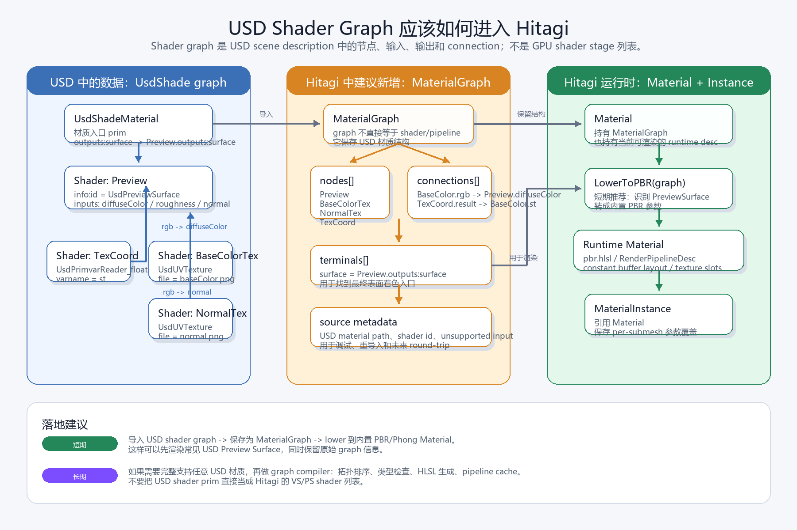

# USD 材质与 Hitagi 材质设计对比

本文对比 USD 的材质模型和 HitagiEngine 当前的材质模型，重点关注设计目标、数据归属、运行时行为，以及当前 USD 导入到引擎材质的映射方式。

## 概览

USD 材质是场景描述数据。它通过 `UsdShadeMaterial`、shader 节点、输入参数和节点连接来描述一个表面应该如何被着色。USD 的重点是资产交换、层级组合、可覆盖性，以及尽量不绑定某一个具体渲染器。

Hitagi 材质是运行时渲染资源。`Material` 持有 shader、渲染管线配置和一组默认参数；`MaterialInstance` 引用一个 `Material`，并保存某个 mesh 或 submesh 的参数覆盖。

当前 USD 导入器没有完整保留 USD 材质图。它会把每个绑定的 USD 材质映射到引擎内置的 `Phong` 材质上，然后把支持的颜色、标量和纹理输入复制到一个 Hitagi `MaterialInstance` 中。

## USD 的材质模型

USD 的材质系统主要建立在 `UsdShade` 之上。

- `UsdShadeMaterial` 是 USD 场景中可以绑定到几何体的材质对象。
- Mesh 通过 `UsdShadeMaterialBindingAPI` 绑定材质。
- 一个 material 可以暴露 surface shader 之类的终端输出。
- surface source 通常是一个 `UsdShadeShader`。
- shader input 可以是直接写死的值，也可以连接到其他 shader 节点。
- 纹理读取通常由 `UsdUVTexture` 节点表示，并连接到 shader input。
- 同一个材质可以针对不同 render context 提供不同输出。

这个设计里，材质不一定是一个固定 shader 程序。它更接近一个着色节点网络，里面有参数、连接关系和外部 asset 引用。具体渲染器或导入器需要决定如何解释这张图。

USD 材质的几个重要特点：

- 材质本身是 scene hierarchy 里的 prim。
- 材质绑定和 mesh 几何数据是分离的。
- 材质可以通过 USD layer、reference、variant、override 等机制组合和覆盖。
- 一个材质可以面向 preview rendering、特定渲染器、MaterialX，或其他 shading backend。
- 输入参数可以是连接、覆盖、继承，也可以是 time-sampled 数据。

## Hitagi 的材质模型

Hitagi 的材质模型定义在 `asset` module 中。

`Material` 是一个渲染模板：

- 持有 `gfx::ShaderDesc`。
- 持有 `gfx::RenderPipelineDesc`。
- 持有默认 `MaterialParameter`。
- 通过 `GetPipeline` 延迟创建并缓存 GPU render pipeline。

`MaterialInstance` 是一次具体使用时的材质状态：

- 引用一个 `Material`。
- 按名字保存参数值。
- 可以覆盖 `Material` 中的默认参数。
- 为非纹理参数生成 CPU constant buffer。
- 从纹理参数中收集关联纹理。

当前支持的参数类型包括：

- 标量：`float`、`int32`、`uint32`
- 向量：`vec2i`、`vec2u`、`vec2f`、`vec3i`、`vec3u`、`vec3f`、`vec4i`、`vec4u`、`vec4f`
- `Color`
- `mat4f`
- `shared_ptr<Texture>`

Hitagi 的材质资产用 JSON 编写。内置材质目录是 `assets/materials`；`AssetManager` 初始化时会加载这个目录下的所有 `.json` 文件。

当前内置材质是：

- `assets/materials/phong.json`
- 材质名：`Phong`
- shader：`assets/shaders/phong.hlsl`
- 参数：`diffuse`、`specular`、`ambient`、`emissive`、`roughness`、`metallic`、`occlusion`、`shininess`，以及若干纹理槽

## 直接对比

| 维度 | USD | HitagiEngine |
| --- | --- | --- |
| 主要用途 | 场景交换与材质描述 | 运行时渲染资源 |
| 核心对象 | `UsdShadeMaterial` 加 shader graph | `Material` 加 `MaterialInstance` |
| 着色表达 | shader 节点和连接组成的图 | 固定 shader / pipeline 模板 |
| 绑定方式 | 几何 prim 上的 `UsdShadeMaterialBindingAPI` | `Mesh::SubMesh::material_instance` |
| 参数模型 | shader input、连接、render context | 强类型 name/value 参数列表 |
| 纹理模型 | 通常是连接的 `UsdUVTexture` 节点 | texture 类型的 material parameter |
| 管线状态 | 通常不直接描述底层 GPU pipeline | 显式 `RenderPipelineDesc` |
| 组合能力 | layer、variant、reference、override | 运行时对象关系，没有 USD 式 composition |
| 渲染器绑定 | 可以是通用描述，也可以是特定 render context | 直接绑定引擎 shader 和 pipeline layout |
| 运行时目标 | 描述灵活、便于交换 | draw-time 高效绑定 constant buffer 和 texture |

## 当前 USD 导入映射

当前导入器会打开 USD stage，遍历 prim，构建 mesh，并为每个 USD mesh 查询材质绑定。

对每个 mesh 来说，流程大致是：

1. 创建一个 fallback `MaterialInstance`。
2. 如果可以拿到内置材质，则给 fallback 绑定 `GetMaterial("Phong")`。
3. 如果 mesh 绑定了 `UsdShadeMaterial`，则按 USD material path 创建或复用一个缓存的 `MaterialInstance`。
4. 查询 USD material 的 universal surface source。
5. 把支持的 shader input 复制到 Hitagi instance。
6. 把最终 instance 设置到 Hitagi submesh 上。

当前支持的 USD shader value input：

| USD shader input | Hitagi 参数 |
| --- | --- |
| `diffuseColor` | `diffuse` |
| `specularColor` | `specular` |
| `emissiveColor` | `emissive` |
| `roughness` | `roughness`，并派生出 `shininess` |
| `metallic` | `metallic` |
| `occlusion` | `occlusion` |

当前支持的 USD 纹理连接：

| USD 被连接的 input | 期望连接到的 shader | Hitagi 参数 |
| --- | --- | --- |
| `diffuseColor` | `UsdUVTexture` | `diffuse_texture` |
| `emissiveColor` | `UsdUVTexture` | `emissive_texture` |
| `normal` | `UsdUVTexture` | `normal_texture` |
| `occlusion` | `UsdUVTexture` | `occlusion_texture` |
| `roughness` | `UsdUVTexture` | `metallic_roughness_texture` |
| `metallic` | `UsdUVTexture` | `metallic_roughness_texture` |

纹理会通过 USD asset resolver 解析路径，读入内存，根据扩展名解码，并按 resolved path 缓存，最后变成 Hitagi `Texture` 对象。

## 当前没有保留的 USD 能力

当前导入器有意把 USD 材质压平到内置 `Phong` 材质。因此以下 USD 材质能力不会被完整保留：

- 任意 shader node graph
- universal surface 之外的多个 shader output 或 render context
- MaterialX graph
- 特定渲染器的 shader 实现
- UV transform、channel selection、scale/bias、color-space metadata
- opacity、alpha mode、transmission、clearcoat、anisotropy、displacement 等 PBR 扩展
- time-sampled 材质参数
- 导入后的 USD composition 语义
- 回指原始 USD material prim 的持久链接

这是一个实用型导入路径：它能让 USD mesh 使用现有引擎 shader 渲染出来，但它不是一个高保真的 USD 材质系统。

## 后续演进方向

### 继续使用模板映射

继续使用 `Phong`，或者增加一个内置 `PBR` 材质作为 USD 导入目标。这是最简单的路线，适合当前 renderer，只需要逐步增加更多参数映射。

### 增加 PBR 材质模板

新增一个更接近 USD Preview Surface 的内置 `PBR` 材质，例如支持：

- base color
- metallic
- roughness
- emissive
- normal
- occlusion
- opacity
- base color texture
- metallic/roughness texture

然后把 USD Preview Surface 的输入映射到 `PBR`，而不是 `Phong`。这条路线能更好地兼容现代 USD 资产，同时保留当前 `Material` / `MaterialInstance` 架构。

### 保存 USD 来源元数据

仍然生成引擎原生 material instance，但额外保存 source USD material path、source shader id、source texture asset path、unsupported input name 等元数据。这样可以改善调试和未来 reimport，不需要立刻改变渲染行为。

### 增加材质图层

把导入的 USD shader network 表示成引擎自己的 material graph，然后编译或降低成可渲染的 `Material`。这是保真度最高的路线，但也是架构变化最大的一条。

## 建议方向

就当前代码结构来说，最自然的下一步是新增一个内置 `PBR` 材质，并继续让 USD importer 翻译成引擎原生的 `MaterialInstance`。

这个方案能保留简单直接的运行时材质设计，同时明显提升 USD 资产兼容性。完整 material graph 可以等到确实需要引擎内材质编辑或高保真 USD round-trip 时再引入。
